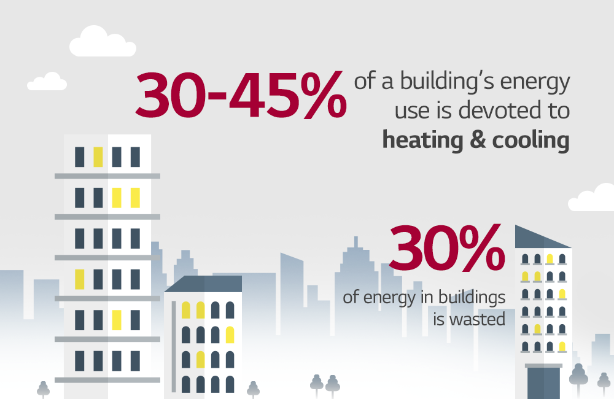
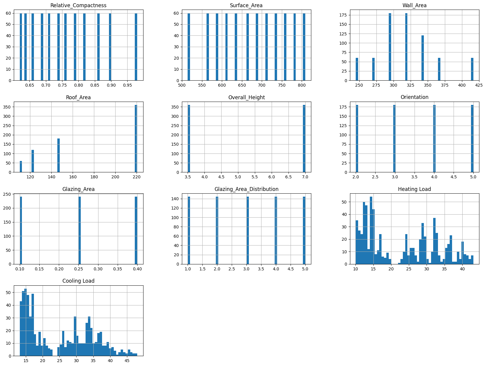
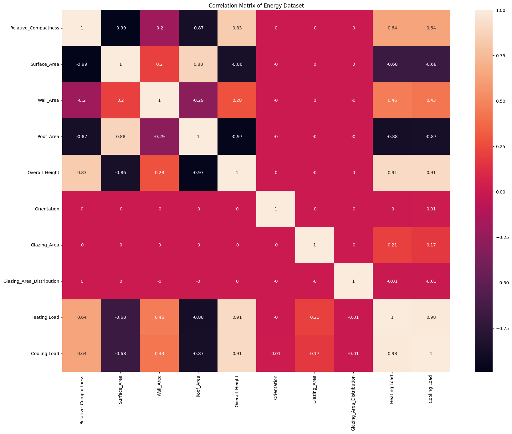
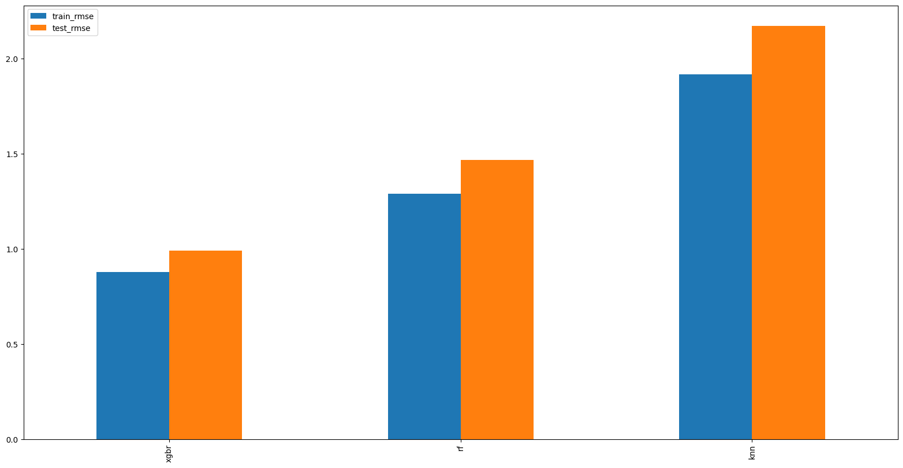

# Energy Efficiency on Building - Wildan Aziz Hidayat

## Domain Proyek

Pada bagian ini, kami akan membahas latar belakang terkait efisiensi energi pada bangunan. Penelitian ini bertujuan untuk menilai kebutuhan beban pemanasan dan pendinginan bangunan sebagai fungsi dari parameter bangunan yang berbeda. Efisiensi energi sangat penting untuk mengurangi konsumsi energi dan biaya operasional, serta mengurangi dampak lingkungan.

- Mengatasi masalah ini penting untuk membantu meningkatkan efisiensi energi pada bangunan, yang pada gilirannya dapat mengurangi emisi karbon.
- Menggunakan beberapa model machine learning untuk memprediksi HL (Beban Pemanasan) dan CL (Beban Pendinginan) pada data komponen yang diberikan. Model yang akan digunakan adalah model regresi. Kemudian memilih model dengan error terkecil, beberapa model yang akan digunakan adalah:
a. K-Nearest Neighbors

- Memilih model dengan error terkecil untuk digunakan dalam memprediksi efisiensi bangunan yang muncul
- Contoh referensi terkait: [Predictive Modelling for Heating and Cooling Load Systems of Residential Building](https://ieeexplore.ieee.org/document/10234992) 

## Business Understanding
Seperti yang telah dijelaskan sebelumnya, terkadang bangunan seperti rumah tinggal dapat mempengaruhi lingkungan khususnya pada penggunaan sumber daya listrik. Penggunaan model pembelajaran mesin regresi dapat membantu memprediksi energi bangunan yang lebih efisien dengan harapan untuk mengurangi dampak lingkungan dengan menciptakan bangunan yang nyaman dihuni dengan sirkulasi udara yang baik. Sirkulasi udara yang baik adalah bagaimana mengeluarkan beban pemanasan suhu panas yang dikeluarkan ketika suhu dilingkungan sangat tinggi dan menjaga suhu kestabilan suhu dingin ketika suhu diluar bangunan dingin.  Bagian ini bertujuan untuk menjelaskan masalah bisnis dan tujuan yang ingin dicapai melalui proyek ini.

### Problem Statements

- Bagaimana cara memprediksi kebutuhan beban pemanasan sebuah gedung?
- Bagaimana cara memprediksi kebutuhan beban pendinginan gedung?
- Bagaimana mendapatkan model pembelajaran mesin dengan tingkat kesalahan di bawah 5%?

### Goals

- Memprediksi beban pemanasan untuk meningkatkan efisiensi energi.
- Memprediksi beban pendinginan untuk mengoptimalkan penggunaan energi.
- Berhasil mendapatkan model dengan tingkat kesalahan kurang dari 5%.

### Solution Statements
- Gunakan EDA untuk memahami sifat data dan mengidentifikasi fitur yang memengaruhi Beban Pemanasan dan Beban Pendinginan
- Menggunakan algoritma pembelajaran mesin yang mudah digunakan dalam proses pembuatan from scratch yakni KNN.
- Melakukan penyetelan hyperparameter untuk meningkatkan kinerja model berdasarkan metrik evaluasi seperti **Root Mean Square Error (RMSE)**.

## Data Understanding

Dataset yang digunakan dalam proyek ini diperoleh dari [UCI Machine Learning Repository](https://archive.ics.uci.edu/ml/datasets/Energy+efficiency). Dataset ini berisi parameter bangunan yang terkait dengan efisiensi energi.

### Variabel-variabel yang terdapat pada Dataset
Berikut ini adalah variabel-variabel yang terdapat di dalam dataset beserta deskripsinya:
- **X1**: Relative Compactness - Kepadatan relatif bangunan
- **X2**: Surface Area - Luas permukaan bangunan
- **X3**: Wall Area - Luas dinding bangunan
- **X4**: Roof Area - Luas atap bangunan
- **X5**: Overall Heigt - Ketinggian total bangunan
- **X6**: Orientation - Orientasi bangunan
- **X7**: Glazing Area - Luas Distribusi
- **X8**: Glazing Area Distribution - Distribusi area kaca
- **Y1**: Heating Load - Beban pemanasan. Ini sebagai target dataset
- **Y2**: Cooling Load - Beban pendinginan. Ini sebagai target dataset

### Data Information ###
Dataset ini berisi 768 sampel

| # | Column     | Non-Null Count | Dtype  
|---|------------|----------------|---------
| 0 | Relative_Compactness   | 768 non-null       | float64
| 1 | Surface_Area   | 768 non-null       | float64
| 2 | Wall_Area   | 768 non-null       | float64
| 3 | Roof_Area   | 768 non-null       | float64
| 4 | Overall_Height   | 768 non-null       | float64
| 5 | Orientation   | 768 non-null       | int64
| 6 | Glazing_Area   | 768 non-null       | float64
| 7 | Glazing_Area_Distribution   | 720 non-null       | int64
| 8 | Heating Load   | 768 non-null       | float64
| 9 | Cooling Load   | 768 non-null       | float64
dtypes: float64(8), int64(2)

Informasi missing value

| # | Column     | Missing Value 
|---|------------|----------------
| 0 | Relative_Compactness   | 0 
| 1 | Surface Area   | 0 
| 2 | Wall_Area   | 0 
| 3 | Roof_Area   | 0 
| 4 | Overall_Height   | 0 
| 5 | Orientation   | 0 
| 6 | Glazing_Area   | 48 
| 7 | Glazing_Area_Distribution   | 48 
| 8 | Heating Load   | 0 
| 8 | Cooling Load   | 0 

Pada beberapa komponen seperti *Area Kaca*, *Distribusi Area Kaca*, memiliki nilai 0.
Dalam beberapa kasus, nilai 0 akan dianggap sebagai *nilai yang hilang*.

### Data Visualization
- Univariate Analysis

Figure 1. Univariate Analysis

Dari hasil analisis univariat pada dataset, terlihat bahwa kedua variabel target, yaitu Heating Load dan Cooling Load, memiliki distribusi data yang bervariasi. Heating Load cenderung tersebar dalam rentang 10 hingga 40, dengan pola distribusi yang relatif merata, menunjukkan adanya variasi yang signifikan antar sampel. 

Sementara itu, Cooling Load memiliki rentang antara 15 hingga 45 dengan distribusi yang lebih terfokus pada nilai-nilai di tengah rentang tersebut. Untuk fitur-fitur prediktor, seperti Relative Compactness, Surface Area, Wall Area, Roof Area, dan Overall Height, terlihat bahwa distribusi data cenderung terkonsentrasi pada nilai-nilai tertentu, yang mengindikasikan sifat data diskret atau kategori. Roof Area, misalnya, memiliki sebagian besar data terkonsentrasi pada beberapa kategori spesifik, sedangkan Wall Area menunjukkan distribusi yang lebih bervariasi. Selain itu, fitur Orientation, Glazing Area, dan Glazing Area Distribution juga didominasi oleh nilai-nilai diskret tertentu. 

Secara keseluruhan, karakteristik dataset ini menunjukkan bahwa ada kemungkinan hubungan non-linear antara beberapa fitur dan target, sehingga analisis lanjutan seperti korelasi atau analisis feature importance diperlukan untuk menentukan pengaruh masing-masing fitur terhadap Heating Load dan Cooling Load.

- Multivariate Analysis

Figure 2. Correlation Matrix

Dari correlation matrix yang ditampilkan, dapat disimpulkan bahwa Heating Load memiliki korelasi positif yang sangat kuat dengan Overall Height (nilai korelasi sebesar 0.91). Ini menunjukkan bahwa semakin tinggi bangunan, semakin besar kemungkinan nilai Heating Load akan meningkat. Selain itu, terdapat korelasi positif sedang dengan Relative Compactness (0.64) dan korelasi negatif yang cukup kuat dengan Roof Area (-0.88) dan Surface Area (-0.68). Hal ini menunjukkan bahwa luas atap dan permukaan yang lebih besar cenderung berhubungan dengan penurunan Heating Load.

Fitur seperti Wall Area menunjukkan korelasi positif yang lebih lemah dengan Heating Load (0.46), sementara Glazing Area dan Glazing Area Distribution memiliki korelasi sangat rendah (di bawah 0.21), yang mengindikasikan pengaruhnya terhadap Heating Load kemungkinan kecil. Variabel Orientation juga menunjukkan korelasi hampir nol, sehingga tidak signifikan dalam memengaruhi Heating Load.

Kesimpulannya, fitur yang paling berpengaruh terhadap Heating Load adalah Overall Height, diikuti oleh Roof Area, Surface Area, dan Relative Compactness. Sementara fitur seperti Glazing Area, Glazing Area Distribution, dan Orientation tampaknya tidak memiliki pengaruh yang signifikan. Hal ini memberikan gambaran awal tentang fitur yang perlu lebih diperhatikan dalam membangun model prediksi untuk Heating Load.

## Data Preparation

Langkah-langkah persiapan data dilakukan untuk memastikan dataset bersih, konsisten, dan cocok untuk melatih model machine learning.
Langkah-langkah ini dilakukan dalam Persiapan Data:

- **Pengecekan Missing Value dan Menghapusnya:** Pada data yang dilampirkan bahwa terdapat beberapa kolom yang mengandung nilai 0 seperti *Glazing Area* dan *Glazing Area Distribution*. Biasanya nilai 0 ini mengandung dianggap sebagai nilai yang hilang.
- **Data Splitting:** Dataset dibagi menjadi set pelatihan dan set pengujian (pembagian 80:20) untuk menilai kemampuan generalisasi model dan menghindari overfitting.
- **Feature Scaling:** Pada Algoritma KNN membutuhkan normalisasi atau standarisasi untuk memastikan semua fitur berkontribusi secara merata pada perhitungan jarak.

## Modelling
Pada bagian ini, beberapa model pembelajaran mesin digunakan untuk memprediksi beban pemanasan dan pendinginan gedung berdasarkan parameter gedung. Berikut ini adalah model-model yang dipilih, alasan pemilihannya, kelebihan dan kekurangannya, serta langkah-langkah penyetelan hiperparameter.

### Model yang Digunakan

#### 3. Pengklasifikasi K-Nearest Neighbors (KNN)
KNN adalah algoritma yang menggunakan kedekatan data untuk memprediksi nilai berdasarkan data terdekat. Algoritma ini lebih sederhana dan bekerja dengan baik pada data yang kecil.

**Kelebihan:** 
- Mudah dimengerti dan diimplementasikan.
- Tidak memerlukan banyak asumsi tentang data.

**Kekurangan:**
- Performa dapat menurun pada dataset yang besar atau data berdimensi tinggi.
- Sangat terpengaruh oleh penskalaan fitur, sehingga membutuhkan normalisasi atau standarisasi.

**Penyetelan Hyperparameter:**
- `n_neighbors`: Menentukan jumlah tetangga terdekat untuk memprediksi nilai. Biasanya diuji dengan nilai yang berbeda.

### Pemilihan dan Perbaikan Model

Berdasarkan model yang digunakan, penyetelan hyperparameter dilakukan untuk meningkatkan kinerja model. Hasil dari KNN berdasarkan metrik evaluasi yang telah ditetapkan, yaitu **Root Mean Squared Error (RMSE)**.
- **RMSE Latih:** 1.882784
- **RMSE Uji:** 2.561768 

Hasil ini menunjukkan bahwa XGBoost memberikan kinerja generalisasi terbaik di antara model yang diuji. RMSE yang rendah pada dataset pelatihan dan pengujian menunjukkan bahwa model ini menangkap pola dalam data secara efektif tanpa persentase overfitting yang tidak lebih dari setengah data latih.

## Evaluasi
**Root Mean Squared Error (RMSE) ** digunakan sebagai metrik evaluasi. Hal ini diimplementasikan dengan menggunakan fungsi `mean_squared_error` dari `sklearn`, diikuti dengan menerapkan akar kuadrat dengan `numpy.sqrt()` untuk menghitung nilai RMSE.

RMSE mengukur kesalahan dengan mengkuadratkan perbedaan antara nilai sebenarnya (`y_true`) dan nilai prediksi (`y_pred`), rata-rata perbedaan kuadrat ini, dan kemudian mengambil akar kuadrat.
Rumus untuk RMSE adalah:

Di mana:  
-  RMSE**: Kesalahan Rata-rata Kuadrat Akar (Root Mean Squared Error)  
- **y**: Nilai aktual  
- **ŷ**: Nilai prediksi  
- **i**: Indeks data  
- **n**: Jumlah titik data  

Metrik ini membantu dalam melatih model dan mengevaluasi kesalahannya secara efektif.

Tabel di bawah ini menunjukkan loss untuk setiap model:

| Model | Train RMSE | Test RMSE |
|-------|------------|-----------|
| KNN   | 1.882784   | 2.561768  |

Plot di bawah ini menunjukkan loss untuk setiap model:

Tabel di bawah ini menunjukkan hasil prediksi untuk setiap model:

| Heating Load (true) | Cooling Load (true) | KNN_Heating Load (pred) | KNN_Cooling Load (pred) |
|---------------------|---------------------|-------------------------|-------------------------|
| 14.33               | 15.41               | 15.04                   | 16.87                   |
| 30.00               | 29.93               | 34.45                   | 32.15                   |
| 42.62               | 39.07               | 38.36                   | 35.23                   |
| 32.09               | 31.70               | 30.98                   | 32.67                   |
| 12.27               | 15.27               | 12.26                   | 14.78                   |
| 10.64               | 13.67               | 10.88                   | 13.58                   |
| 14.54               | 16.43               | 14.37                   | 16.59                   |
| 32.74               | 33.88               | 32.56                   | 33.99                   |
| 31.66               | 36.20               | 30.85                   | 32.86                   |
| 37.26               | 34.62               | 32.28                   | 33.32                   |

Dari data tersebut, terlihat bahwa model regresi dapat memprediksi Beban Pemanasan dan Beban Pendinginan berdasarkan data komponen yang diberikan. model KNN dapat memprediksi hingga tingkat kesalahan kurang dari 5%, yang menunjukkan prediksi yang sangat sesuai dengan nilai aktual, meskipun terkadang terdapat sedikit perbedaan.

Namun demikian, masih ada ruang untuk perbaikan, khususnya dalam proses pemodelan. Meningkatkan kinerja model KNN melalui penyetelan hiperparameter dapat mengurangi kesalahan lebih lanjut, sehingga memungkinkan prediksi yang lebih akurat untuk beban pemanasan dan beban pendinginan dengan deviasi yang minimal.

## Kesimpulan

Dalam evaluasi model, hasilnya menunjukkan bahwa model XGBRegressor memberikan kinerja terbaik, mencapai RMSE 0,98 pada set data uji. Hal ini menunjukkan bahwa XGBRegressor dapat memprediksi beban pemanasan dan beban pendinginan dengan kesalahan kurang dari 1% dari nilai aktual.

Model lain, seperti Random Forest, juga menghasilkan kesalahan yang relatif rendah, meskipun model KNN menunjukkan kesalahan yang sedikit lebih tinggi sebagai perbandingan. Meskipun demikian, semua model tersebut efektif dalam memprediksi beban pemanasan dan beban pendinginan dengan akurasi yang masuk akal.

Proyek ini berhasil memenuhi tujuannya untuk memprediksi beban pemanasan dan beban pendinginan menggunakan model pembelajaran mesin. Namun, penyetelan hiperparameter lebih lanjut dari XGBRegressor dapat mengurangi kesalahan lebih banyak lagi, memastikan keandalan yang lebih besar dalam prediksi.

# References
##### S. K. Tiwari, J. Kaur, dan R. Kaur, "Predictive Modelling for Heating and Cooling Load Systems of Residential Building," 2024. [Online]. Tersedia: https://ieeexplore.ieee.org/document/10503016/authors#authors.
